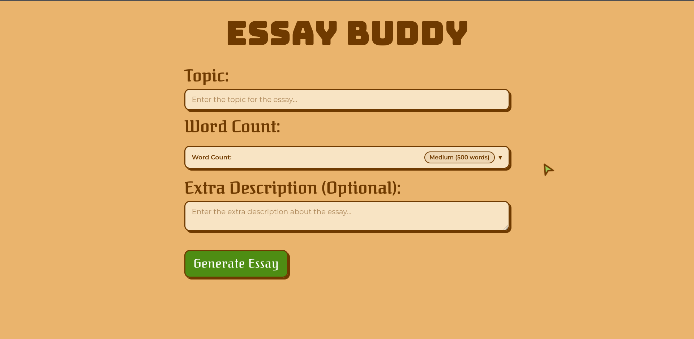

# Essay Buddy

> A simple AI assistant which can help you write essays.

<p>
    <a href="https://essaybuddy.vercel.app" target="_blank">
       
    </a>
</p>

<p>
    <a href="https://github.com/prasoonkandel/notes_cpp/fork" target="_blank">
       
    </a>
</p>
## Features

- Generates an essay on your desired topic.
- Lets you choose the length of essay according to your need.
- You provide additional description if you want.
- Responsive UI and design.
- Beautiful custom cursor and cursor nimation in UI.
- Felxible backend if want to use this locally.

## Tech Stack:

  

## Web UI Screenshot:



## Project Setup Guide:

1. Clone the repository

```bash
git clone https://github.com/prasoonkandel/essay_buddy.git
cd essay_buddy
```

2. Install dependencies

```bash
pip install -r requirements.txt
```

```bash
cd frontend
npm install
```

3. Configure environment

Create a `.env` file in the project root and add:

```env
AI_URL=https://your-ai-provider-endpoint
AI_KEY=your_api_key_here
AI_MODEL=your_model_name
```

> Note: This project currently uses OpenRouter as AI provider. Using a different AI provider may require code changes.

Create a `.env` file in the frontend dir and add:

```env
API_BASE_URL=https://your-backend-url.com/
# Example: http://localhost:5000/
```

4. Run the app (new terminal)

```bash
python app.py
```

5. Run frontend (new terminal)

```bash
cd frontend
npm run dev
```

## How this works:

- The frontend calls the api of our backend.
- The backend recieves the data from api call.
- It processes the data and creates a prompt.
- The essayGenerator then calls a LLM API.
- The Backend then sends the generated essay to frontend.
- Frontend then displays the essay beautifully.

> ### Built By Prasoon Kandel
